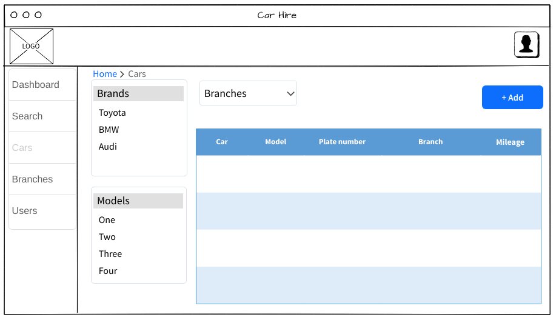
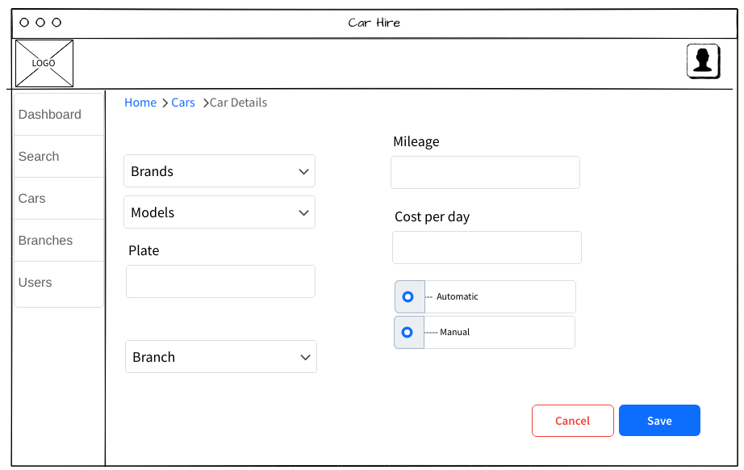
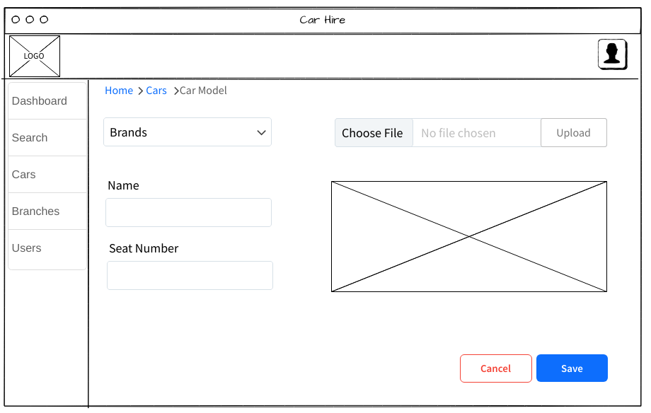
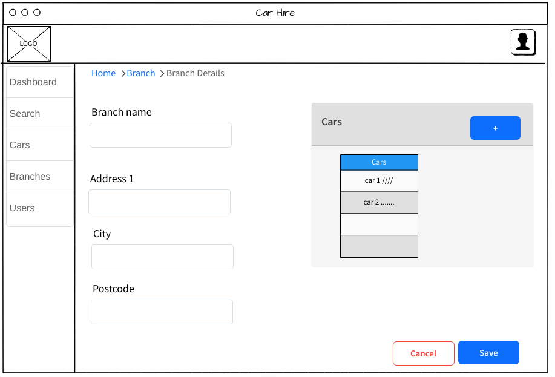
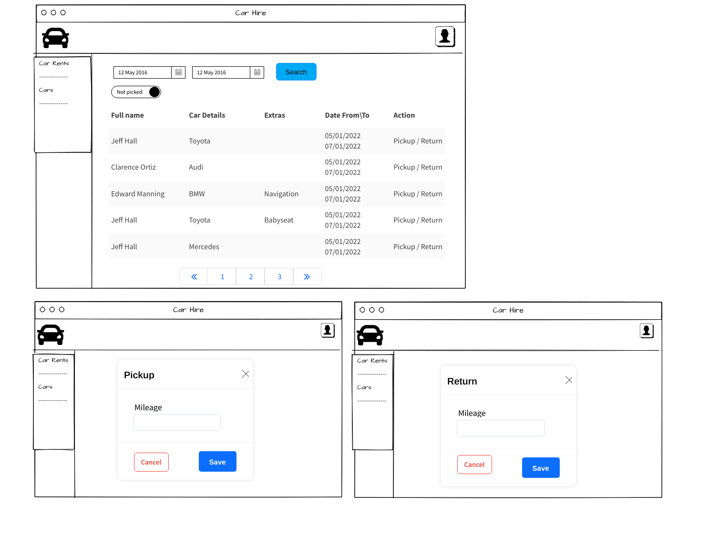
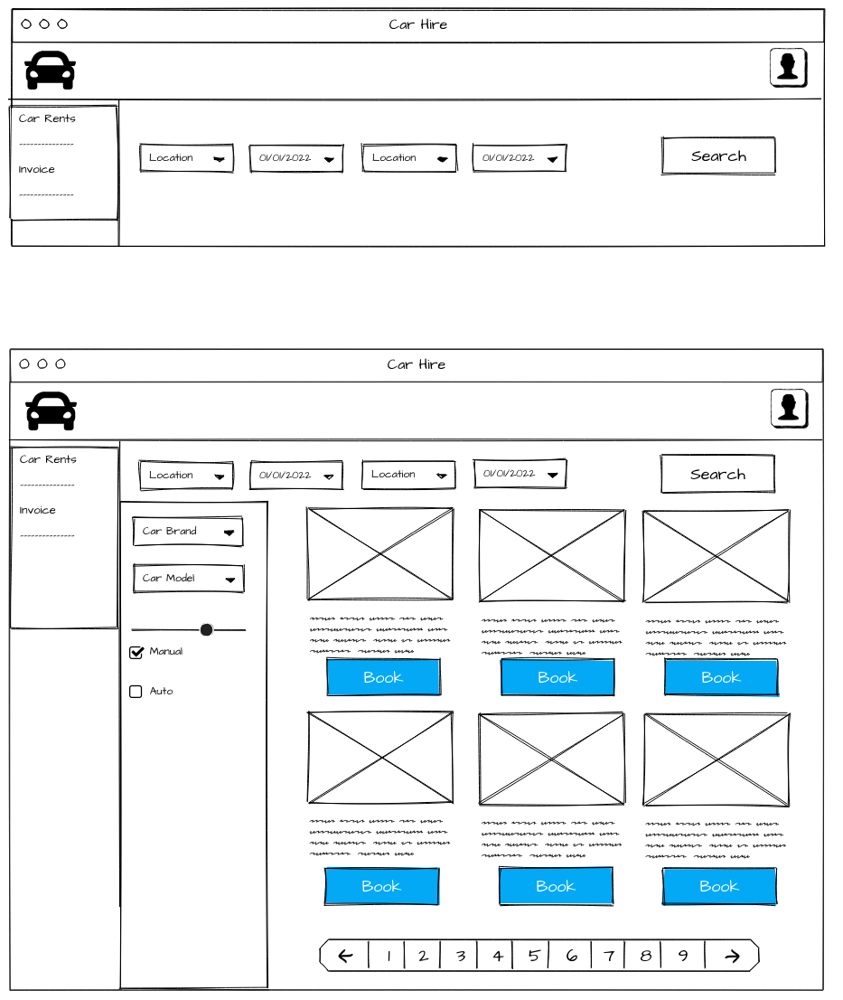
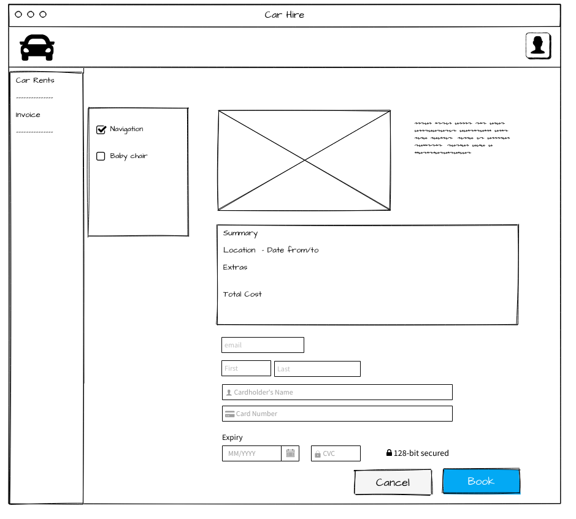

# CarHire (In progress)
CarHire project is for a car rental broker, meaning company arrange car rental on your behalf. 
They provide a place for customer to compare deals from many different car rental companies, helping them find the right deal for you, every time.

As a carhire.com  customer:
When a customer book your car, enter into a contract with them: the company are agreeing to arrange and manage your booking when a customer pick your car up,
enter into a contract with the rental company: they are agreeing to provide the car.

# Features

| Id | Tasks \ Users   | Company | Branch | Customer | Status |
| -- | --------------- | - | - | - | - |
| 1  | Cars Add\Edit   | ✅ |  |  | |
| 2  | Branch Add\Edit | ✅ |  |  |  |
| 3  | Car Hire Add    | ✅ |  | ✅ |  |
| 4  | Car Hire Pick   | ✅ | ✅ |  | |
| 5  | Car Hire Return | ✅ | ✅ |  |  |
| 6  | Car Hire Search | ✅ | ✅ |  | |
| 7  | Report          | ✅ |  |  |  |
| 8  | Dashboard       | ✅ |  |  |  |
| 9  | Invoice         | ✅ |  | ✅ |  |

# Goals

- Making clean acrhitecture with CQRS
- Using API
- Secure web application with using JWT token
- Practising unit testing 
- Practising web Blazor

# Technologies

**[`.NET Core 6`](https://dotnet.microsoft.com/download)**
**[`Blazor`](https://dotnet.microsoft.com/apps/aspnet/web-apps/blazor)** 
**[`EF Core`](https://github.com/dotnet/efcore)**
**[`API swagger`](https://swagger.io)**

# UML Design

 UML 
<blockquote>

</blockquote>

# Design Template

https://wireframepro.mockflow.com/

 Admin 
<blockquote>

 Cars 
<blockquote>

</blockquote>

 Car Detail 
<blockquote>

</blockquote>

 Car Model 
<blockquote>

</blockquote>

 Branch Detail 
<blockquote>

</blockquote>

</blockquote>

 Branch 
<blockquote>

 Car Update 
<blockquote>

</blockquote>

</blockquote>

 Customer 
<blockquote>

 Car Search 
<blockquote>

</blockquote>

 Car Book 
<blockquote>

</blockquote>

</blockquote>

# Completed Design

test

